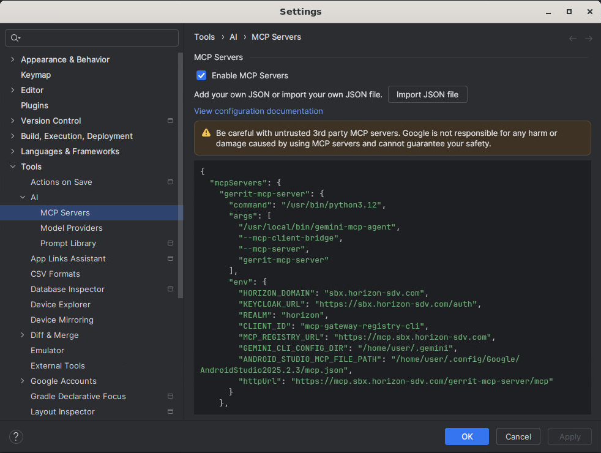

# MCP Setup and Usage Guide

This guide provides instructions for setting up MCP servers in MCP Gateway Registry and using them with Gemini-CLI and Gemini Code Assist in IDEs.

## Table of Contents
- [Prerequisites](#prerequisites)
- [Setup Steps](#setup-steps)
  - [Step 1: Enable MCP Servers in MCP Gateway Registry](#step-1-enable-mcp-servers-in-mcp-gateway-registry)
  - [Step 2: Add New MCP Server (Optional)](#step-2-add-new-mcp-server-optional)
  - [Step 3: Configure Your Local Environment](#step-3-configure-your-local-environment)
  - [Step 4: Use MCP Servers with Gemini-CLI and Gemini Code Assist](#step-4-use-mcp-servers-with-gemini-cli-and-gemini-code-assist)
    - [Gemini-CLI in Terminal](#gemini-cli-in-terminal)
    - [Gemini Code Assist in Horizon Code OSS (VS Code)](#gemini-code-assist-in-horizon-code-oss-vs-code)
    - [Gemini Code Assist in Android Studio and Android Studio for Platform](#gemini-code-assist-in-android-studio-and-android-studio-for-platform)
- [Known Issues and Workarounds](#known-issues-and-workarounds)
  - [Server registration](#server-registration)
  - [Server enablement](#server-enablement)
  - [MCP configuration caching across Gemini clients](#mcp-configuration-caching-across-gemini-clients)
  - [Android Studio / ASfP: mcp.json deleted after applying empty config](#android-studio--asfp-mcpjson-deleted-after-applying-empty-config)
- [`gemini-mcp-agent` Documentation](#gemini-mcp-agent-documentation)

## Prerequisites
The following prerequisites must be met before proceeding with the setup:
- Access to MCP Gateway Registry with appropriate permissions.
  - User must be added to either of Keycloak groups:
    - `horizon-mcp-gateway-registry-admins`: Admins can register new or edit existing MCP servers and agents. They have full access to all MCP servers, agents and this app’s API.
    - `horizon-mcp-gateway-registry-users`: Users can only view existing registered MCP servers and agents but have full use access to all MCP servers and agents; and read-only access to this app’s API.
- Workstation Images with Gemini-CLI and Gemini Code Assist installed.

## Setup Steps

### Step 1: Enable MCP Servers in MCP Gateway Registry
1. Log in to MCP Gateway Registry at `https://mcp.<SUB_DOMAIN>.<HORIZON_DOMAIN>/` as an admin using your Keycloak credentials.
2. Navigate to the "MCP Servers" section.
3. In order to access any MCP server, including the pre-registered `gerrit-mcp-server`, make sure that it is ENABLED on the app (bottom right toggle button in server card). By default, newly registered MCP servers are disabled.

### Step 2: Add New MCP Server (Optional)
Steps:
1. Click on the "Register New Server" button.
2. Fill in the details.
3. Make sure you enter the path as `/my-mcp-server/` with trailing slashes on both ends. See [Known Issue](#server-registration).
4. New server should now be visible.
5. Make sure to ENABLE it before use (bottom right toggle button in server card). See [Known Issue](#server-enablement).

### Step 3: Configure Your Local Environment
Open your Cloud Workstation with Gemini-CLI and/or Gemini Code Assist installed, then follow the steps below in order.

This step uses the `gemini-mcp-agent` command-line tool to handle authentication and configuration for you. For detailed usage and all available options, see the `gemini-mcp-agent` Documentation section [below](#gemini-mcp-agent-documentation).

Steps:
1. Open a terminal
2. (Optional) If you need to override default settings, create a `.env` file in your current directory (or set `ENV_FILE_PATH` to point to an existing one):
   ```
   HORIZON_DOMAIN=your-horizon-domain
   KEYCLOAK_URL=your-keycloak-url
   REALM=your-realm
   CLIENT_ID=your-client-id
   MCP_REGISTRY_URL=your-mcp-registry-url
   
   # ONLY set these if you are using non-standard installation paths:
   # GEMINI_CONFIG_HOME=/custom/path/to/.gemini/ (Directory)
   # ANDROID_STUDIO_MCP_FILE_PATH=~/.config/Google/AndroidStudio<VERSION>/mcp.json
   ```
   > **Note on Variable Priority:**
   > The tool looks for configuration in this order:
   > - Terminal Environment Variables (Active exports)
   > - `.env` file via `ENV_FILE_PATH` environment variable (if set)
   > - `.env` file in your Current Working Directory
   > - `~/.gemini/.env` (Global Fallback)
    
3. Run `gemini-mcp-agent`
4. Follow the prompts to authenticate.
5. After the initial setup, you will be prompted to start a background sync. It is highly recommended to do this to keep your session active automatically.
   - Enter `y` or `yes` to start the background sync now.
   - If you choose not to, you can always start it later by running:
   ```bash
   gemini-mcp-agent --daemon-start
   ```

> **Note**: If your SSO session expires (500 Internal Server Error), or `gemini-mcp-agent` is restarted, run `gemini-mcp-agent` again to re-authenticate.  
> For Android Studio/ASfP, refresh IDE MCP settings: disable MCP servers (**Apply**), re-enable MCP servers (**Apply**), then click **OK**.

### Step 4: Use MCP Servers with Gemini-CLI and Gemini Code Assist
Once the `gemini-mcp-agent` is running, your tools are configured to connect to the MCP servers.
For registry-managed MCP servers, the agent writes command-based MCP entries that launch `mcp-client-bridge` for all supported Gemini clients (Gemini CLI, Code OSS, Android Studio, and ASfP). This ensures each request uses fresh runtime authentication instead of cached config tokens.

##### Gemini-CLI in Terminal
1. Open a terminal
2. Before running Gemini CLI in this terminal session, set your GCP project:
   ```bash
   export GOOGLE_CLOUD_PROJECT="<GCP-PROJECT-NUMBER>"
   ```
   You can get this project number from your admin. It is also available in Jenkins pipeline description: `Cloud Workstations > Cluster Admin Operations > Create New Cluster` as `PROJECT`.
3. Run `gemini`
4. Log in to Gemini
5. Run `/mcp`
6. You should see the registered MCP servers along with the pre-registered `gerrit-mcp-server` with status Connected.
7. Now you can run any Gerrit-related query and Gemini will query the MCP server for answers.

##### Gemini Code Assist in Horizon Code OSS (VS Code)
1. Open Horizon Code OSS cloud workstation.
2. From the left sidebar, click on the Gemini icon to open Gemini Code Assist.
3. Complete initial setup > Select `Gemini for Businesses`.
4. Select `Google Cloud Project` and complete further setup
5. In chat window, enable "Agent" mode by clicking on the "Agent" button at the bottom right of the chat window.
6. Run `/mcp`
7. You should see the pre-registered `gerrit-mcp-server` with status Connected.
8. Now you can run any Gerrit-related query and Gemini will query the MCP server for answers.

##### Gemini Code Assist in Android Studio and Android Studio for Platform
1. Open Android Studio or Android Studio for Platform cloud workstation.
2. Open IDE.
3. In Settings > Google Accounts, add and log in with your enterprise account.
4. Open Gemini Code Assist from sidebar.
5. Complete initial setup:
   - Select `Gemini for Businesses`
   - Select the correct `Google Cloud Project`
6. If `gemini-mcp-agent` is not already running, run it from terminal and complete authentication.
7. In IDE settings, open MCP Servers (`Tools > AI > MCP Servers`) and enable MCP servers. Click **Apply** and then **OK**.
   
8. In chat window, enable "Agent" mode by clicking the "Agent" button at the bottom right.
9. Run `/mcp`.
10. You should see the pre-registered `gerrit-mcp-server` with status Connected.
11. Now you can run any Gerrit-related query and Gemini will query the MCP server for answers.

## Known Issues and Workarounds
1. #### Server registration
   While registering new MCP server, make sure to enter the path with trailing slashes on both ends, e.g. `/my-mcp-server/`. Otherwise, Gemini-CLI and Gemini Code Assist will not be able to connect to the server.

2. #### Server enablement
   Server is disabled by default on new registration, including the pre-registered gerrit-mcp-server. Make sure to ENABLE it before use.

3. #### MCP configuration caching across Gemini clients
   Gemini clients may cache MCP configuration for the active session (`settings.json` for Gemini-CLI/Code OSS, `mcp.json` for Android Studio/ASfP).
   - To avoid stale-token failures, `gemini-mcp-agent` configures registry-managed MCP servers to use `mcp-client-bridge` across all supported Gemini clients.
   - The bridge reads fresh auth from `~/.gemini/mcp-gateway-registry-token.json` for every forwarded request.
   - This keeps authentication current even if the client keeps an older cached config in memory.
   - For Gemini-CLI terminal sessions, set `GOOGLE_CLOUD_PROJECT` before running `gemini`:
     ```bash
     export GOOGLE_CLOUD_PROJECT="<GCP-PROJECT-NUMBER>"
     ```
   > Client refresh notes:
   > - Gemini-CLI / Code OSS: If the client was already running before `gemini-mcp-agent` setup/sync, restart the client session to load the latest MCP server entries.
   > - Android Studio / ASfP (mandatory when SSO expires, `gemini-mcp-agent` restarts, or remote MCP servers are changed):
   >   1. Open Android Studio Settings > MCP Servers (`Tools > AI > MCP Servers`)
   >   2. Disable MCP servers and click **Apply**
   >   3. Re-enable MCP servers and click **Apply**
   >   4. Click **OK**

4. #### Android Studio / ASfP: mcp.json deleted after applying empty config
   If MCP servers are enabled and you clear the MCP config text box, then click **Apply**, IDE can remove `mcp.json` from filesystem.
   Use these recovery steps:
   1. Open Settings > MCP Servers and disable MCP servers.
   2. Close the Settings window completely. Do not keep it open.
   3. In terminal, stop background sync:
      ```bash
      gemini-mcp-agent --daemon-stop
      ```
   4. Run setup again:
      ```bash
      gemini-mcp-agent
      ```
   5. Go back to Settings > MCP Servers, enable MCP servers, then click **Apply** and **OK**.

## `gemini-mcp-agent` Documentation
The `gemini-mcp-agent` is a command-line tool that simplifies using MCP (Model Context Protocol) servers by handling authentication and configuration for Gemini CLI and Gemini Code Assist in IDEs.

You can find the python source code for `gemini-mcp-agent` [here](/workloads/cloud-workstations/pipelines/workstation-images/common-utils/gemini/gemini-mcp-agent.py).

### What it Does
1. **Authenticates**: Connects to MCP Gateway Registry using browser-based login (Keycloak Device Flow).
2. **Fetches Config**: Retrieves the latest list of available MCP servers and stores the latest auth token in `~/.gemini/mcp-gateway-registry-token.json`.
3. **Updates Client Config Files**: Updates MCP configuration for all supported Gemini clients:
   - `~/.gemini/settings.json` for Gemini CLI and Horizon Code OSS
   - `mcp.json` for Android Studio and ASfP
4. **Uses Bridge Mode for Registry Servers**: For registry-managed servers, writes command-based entries that run `mcp-client-bridge` instead of storing short-lived tokens directly in client config files.
5. **Injects Fresh Token at Runtime**: In bridge mode, forwards `JSON-RPC` requests over HTTPS and injects the latest token from `~/.gemini/mcp-gateway-registry-token.json` for each request.
6. **Keeps Sessions Active**: Supports foreground and background sync to refresh sessions automatically until you stop it or SSO expires.
7. **Manages Registry Server Entries**: Provides `--prune` and `--force` options to clean up or replace tool-managed server entries.
8. **Gemini CLI Environment Note**: The agent does not set shell environment variables. For Gemini CLI terminal sessions, you still need:
   ```bash
   export GOOGLE_CLOUD_PROJECT="<GCP-PROJECT-NUMBER>"
   ```

### Command-Line Options

| Option            | Description
|-------------------|-----------------------------------------------------------------------------------------------------------------------------------------------------------------
| `gemini-mcp-agent`  | Default command. Runs a one-time sync. Uses saved session if available; otherwise starts interactive login.
| `--watch`           | Runs continuous sync in the foreground. Keeps the current terminal occupied until `Ctrl+C`.
| `--daemon-start`    | Starts continuous sync as a background process.
| `--daemon-stop`     | Stops the background sync process.
| `--daemon-status`   | Checks if the background sync process is running.
| `--prune`           | During sync, removes server entries managed by this tool that no longer exist in MCP Gateway Registry.
| `--force`           | During sync, replaces configured MCP servers with the MCP Gateway Registry list. **Warning**: This removes manually added servers.
| `--mcp-client-bridge` | (Internal use) Used by generated config entries for registry-managed servers to proxy MCP traffic and inject fresh auth at runtime. See [MCP configuration caching across Gemini clients](#mcp-configuration-caching-across-gemini-clients).
| `--mcp-server`      | (Internal use) Specifies the target MCP server for `--mcp-client-bridge`.
